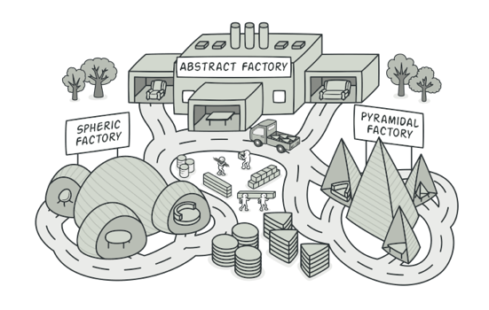
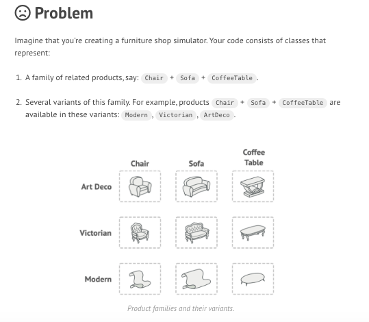

## What is Abstract Factory Design Pattern in Java ##
- Abstract Factory is a creational design pattern that lets you produce families of related objects without specifying their concrete classes.

## Design ##




## Example ##
### Example 1 ###
 ```java
 package raj.learning.designpattern;

public abstract class AbstractDeviceFactory {

	 abstract Device getDeviceType(DeviceType deviceType);
}
```

```java
package raj.learning.designpattern;

public class LaptopFactory extends AbstractDeviceFactory {

	@Override
	Device getDeviceType(DeviceType deviceType) {
		switch(deviceType) {
		case MAC:
			return new Mac();
		case ASUS:
			return new Asus();
		}
		return null;
	}

}
```
```java
package raj.learning.designpattern;

public class MobileFactory extends AbstractDeviceFactory {

	@Override
	Device getDeviceType(DeviceType deviceType) {
		switch(deviceType)
		{
		case MAC:
			return new Iphone();
		
		case SAMSUNG:
			return new Samsung();
			
		}
		return null;
	}

}
```
```java
package raj.learning.designpattern;

public enum DeviceType {
	IPHONE,
	SAMSUNG,
	MAC,
	ASUS
}
```

```java
package raj.learning.designpattern;

public enum FactoryType 
{
	MOBILEFACTORY,
	LAPTOPFACTORY

}
```

```java
package raj.learning.designpattern;

public class NexusRunner {

	public static void main(String[] args) {
		Device asus=FactoryGenerator.getFactory(FactoryType.LAPTOPFACTORY).getDeviceType(DeviceType.ASUS);
		
		System.out.println(asus.getDetails());
		
		 Device samsung=FactoryGenerator.getFactory(FactoryType.MOBILEFACTORY).getDeviceType(DeviceType.SAMSUNG);
		System.out.println(samsung.getDetails());
		
		
		
	}

}
```
