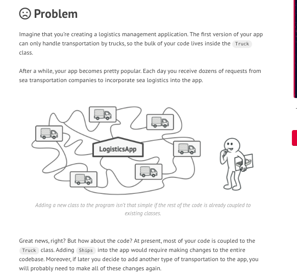
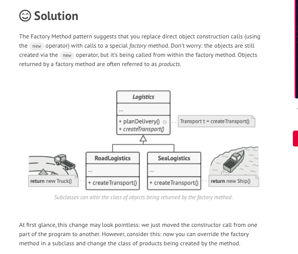
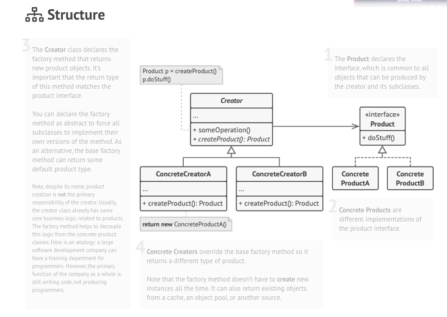

## What is factory design pattern ? ##
Factory Method is a creational design pattern that provides an interface for creating objects in a superclass, 
but allows subclasses to alter the type of objects that will be created.

## Example of factory design pattern (Calendar) in Java ##
```java
Calendar cal=Calendar.getInstance();
cal.get(Calendar.DAY_OF_MONTH);
```

### More information related to factory design pattern ###







## 1. Factory design pattern with real world example using Java Swing ##
Inside the factory design pattern, I have created a form to place an electronic delivery order using a factory. If we select a mobile, then we will place an electronic delivery order for mobile and if we select a laptop then we will place an electronic delivery order for Laptop.


### 1.1. Results when we select electronic type as mobile


### 1.2. Result when we select electronic type as laptop 


## Example ##
### Example 1 ###
```java
package raj.design.delivery.service;

import raj.design.pattern.util.ElectronicDelivery;

public class ElectronicDeliveryFactory 
{
	public static ElectronicDeliveryServiceInterface getElectronicDelivery(ElectronicDelivery electronicDelivery)
	{
		switch(electronicDelivery)
		{
		case MOBILE:
			return new MobileDeliveryService();
		
	
		default:
			return new LaptopDeliveryService();
 		}
	}

}
```
```java
package raj.design.delivery.service;

import java.awt.Component;

import raj.design.pattern.model.Order;

public interface ElectronicDeliveryServiceInterface 
{
	public void send(Component component,Order order);
}
```

```java
package raj.design.delivery.service;

import java.awt.Component;

import javax.swing.JOptionPane;

import raj.design.pattern.model.Order;

public class LaptopDeliveryService implements ElectronicDeliveryServiceInterface {

	public void send(Component component,Order order) {
		// TODO implement here
		JOptionPane.showMessageDialog(component,"Delivery Order is created for Laptop");  
	}
}
```
```java
package raj.design.delivery.service;

import java.awt.Component;

import javax.swing.JOptionPane;

import raj.design.pattern.model.Order;

public class MobileDeliveryService implements ElectronicDeliveryServiceInterface{

	public void send(Component component,Order order) {
		// TODO implement here
		JOptionPane.showMessageDialog(component,"Delivery Order is created for Mobile");  
	}
}
```

```java
package raj.design.pattern.model;

import raj.design.pattern.util.ElectronicDelivery;

public class Order 
{
	private String customerName;
	private String address;
	public Order(String customerName, String address) {
		super();
		this.customerName = customerName;
		this.address = address;
	}
	public String getCustomerName() {
		return customerName;
	}
	public void setCustomerName(String customerName) {
		this.customerName = customerName;
	}
	public String getAddress() {
		return address;
	}
	public void setAddress(String address) {
		this.address = address;
	}
}
```

```java
package raj.design.pattern.util;

public enum ElectronicDelivery 
{
	LAPTOP{
	   	public String toString()
	   	{
	   		return "Laptop";
	   	}
	},
	MOBILE{
		public String toString()
	   	{
	   		return "Mobile";
	   	}
	}
}
```
```java
package raj.design.pattern.ui;

import java.awt.Container;
import java.awt.Font;
import java.awt.event.ActionEvent;
import java.awt.event.ActionListener;

import javax.swing.ButtonGroup;
import javax.swing.JButton;
import javax.swing.JComboBox;
import javax.swing.JFrame;
import javax.swing.JLabel;
import javax.swing.JRadioButton;
import javax.swing.JTextArea;
import javax.swing.JTextField;

import raj.design.delivery.service.ElectronicDeliveryFactory;
import raj.design.delivery.service.ElectronicDeliveryServiceInterface;
import raj.design.pattern.model.Order;
import raj.design.pattern.util.ElectronicDelivery;

public class ElectronicRegistrationForm extends JFrame implements ActionListener 
{
	
private Container formContainer; 
private JLabel title; 
private JLabel name; 
private JLabel address;
private JLabel electronicType; 
private JComboBox electronicDeliveryType;
private JTextField txtName;
private JTextField txtAddress;
private JButton sub; 


public ElectronicRegistrationForm() 
{ 
    setTitle("Java swing project to illustrate factory design pattern"); 
    setBounds(300, 90, 900, 600); 
    setDefaultCloseOperation(EXIT_ON_CLOSE); 
    setResizable(false); 

    formContainer = getContentPane(); 
    formContainer.setLayout(null); 

  
    name = new JLabel("Name"); 
    name.setFont(new Font("Arial", Font.PLAIN, 20)); 
    name.setSize(100, 20); 
    name.setLocation(100, 100); 
    formContainer.add(name); 

    txtName = new JTextField(); 
    txtName.setFont(new Font("Arial", Font.PLAIN, 15)); 
    txtName.setSize(450, 20); 
    txtName.setLocation(200, 100); 
    formContainer.add(txtName); 

    address = new JLabel("Address"); 
    address.setFont(new Font("Arial", Font.PLAIN, 20)); 
    address.setSize(100, 20); 
    address.setLocation(100, 150); 
    formContainer.add(address); 

    txtAddress = new JTextField(); 
    txtAddress.setFont(new Font("Arial", Font.PLAIN, 15)); 
    txtAddress.setSize(450, 20); 
    txtAddress.setLocation(200, 150); 
    formContainer.add(txtAddress); 
    
    
    electronicType = new JLabel("Electronic"); 
    electronicType.setFont(new Font("Arial", Font.PLAIN, 20)); 
    electronicType.setSize(100, 20); 
    electronicType.setLocation(100, 200); 
    formContainer.add(electronicType); 

    electronicDeliveryType= new JComboBox(ElectronicDelivery.values());
    electronicDeliveryType.setFont(new Font("Arial", Font.PLAIN, 15)); 
    electronicDeliveryType.setSize(450, 20); 
    electronicDeliveryType.setLocation(200, 200); 
    formContainer.add(electronicDeliveryType);

    
    sub = new JButton("Submit"); 
    sub.setFont(new Font("Arial", Font.PLAIN, 15)); 
    sub.setSize(100, 20); 
    sub.setLocation(520, 250); 
    sub.addActionListener(this); 
    formContainer.add(sub); 
    setVisible(true); 
} 
 
public void actionPerformed(ActionEvent e) 
{ 
    String name=txtName.getText();
    String address=txtAddress.getText();
    ElectronicDelivery electronicDelivery=(ElectronicDelivery)electronicDeliveryType.getSelectedItem();
    Order order=new Order(name,address);
    
    ElectronicDeliveryServiceInterface electronicDeliveryService=ElectronicDeliveryFactory.getElectronicDelivery(electronicDelivery);
    electronicDeliveryService.send(this,order);
} 

} 
```
```java
package raj.design.pattern.ui;

import java.awt.BorderLayout;
import java.awt.event.ActionEvent;
import java.awt.event.ActionListener;

import javax.swing.JComboBox;
import javax.swing.JFrame;
import javax.swing.JLabel;
import javax.swing.JTextArea;
import javax.swing.JTextField;

import raj.design.pattern.util.ElectronicDelivery;

public class FactoryUiProvider extends JFrame{
	  public static void main(String arg[]) {   
		  ElectronicRegistrationForm electronicRegistrationForm=new ElectronicRegistrationForm();
	    
	  }
	}
```
